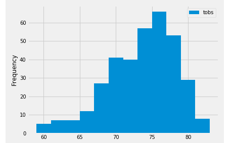

# Advanced_Data
# The purpose of this project is to use soe climate analysis on the area to plan a vacation to Hawaii
## Step 1
Use Python and SQLAlchey to do climate analysis and data exploration of the climate database; in this case, from a file named hawaii.sqlite.
  * Choose a start date and end date for your trip. Make sure that your vacation range is approximately 3-15 days total
  * Use SQLAlchemy create_engine to connect to  the sqlite database
  * Use SQLAlchemy automap_base() to reflect your tables into classes and save a reference to those classes called Station and      Measurement
  
 ### Preciptation Analysis

  * Design a query to retrieve the last 12 months of precipitation data
  * Select only the date and prcp values.
  * Load the query results into a Pandas DataFrame and set the index to the date column.
  * Sort the DataFrame values by date.
  * Plot the results using the DataFrame plot method.
  
### Station Analysis 

  
  
  
  

The main file is climate_bv.ipynb
With the climate_bv.ipynb file open, run all the cells.  The flask section as tested will work from Jupyter notebooks and you will be able to call the specified api's as designed from the local host.  
The climate.py file can also be used to run Flask program if needed.  
The resources folder contains the sqlite file of the analyzed data along with the two original .csv files as a courtesy and as a reference.

