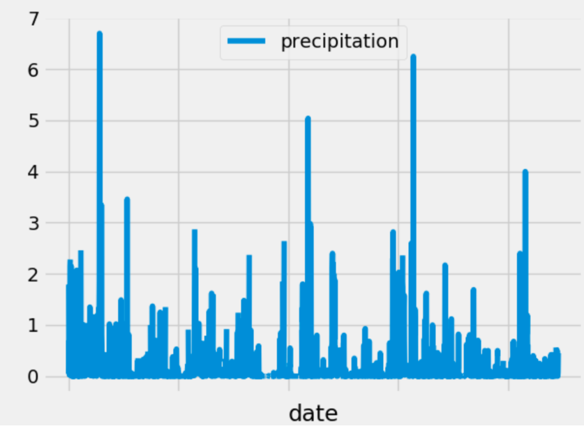

# Advanced_Data
# The purpose of this project is to use soe climate analysis on the area to plan a vacation to Hawaii
## Step 1
Use Python and SQLAlchey to do climate analysis and data exploration of the climate database; in this case, from a file named hawaii.sqlite.
  * Choose a start date and end date for your trip. Make sure that your vacation range is approximately 3-15 days total
  * Use SQLAlchemy create_engine to connect to  the sqlite database
  * Use SQLAlchemy automap_base() to reflect your tables into classes and save a reference to those classes called Station and      Measurement
  
 ### Preciptation Analysis
   
  * Design a query to retrieve the last 12 months of precipitation data
  * Select only the date and prcp values.
  * Load the query results into a Pandas DataFrame and set the index to the date column.
  * Sort the DataFrame values by date.
  * Plot the results using the DataFrame plot method.
  
### Station Analysis 

 * Design a query to calculate the total number of stations.
 * Design a query to find the most active stations.
 * Design a query to retrieve the last 12 months of temperature observation data (tobs)
 
## Step 2 - Climate App
Use Flask to create routes ased on queries that were developed in step 1
### Routes
/ 
 * Home page
 * List all routes that are available.

/api/v1.0/precipitation
 * Convert the query results to a Dictionary using date as the key and prcp as the value.
 * Return the JSON representation of your dictionary.

/api/v1.0/stations
 * Return a JSON list of stations from the dataset.

/api/v1.0/tobs
 * query for the dates and temperature observations from a year from the last data point.
 * Return a JSON list of Temperature Observations (tobs) for the previous year.

/api/v1.0/<start> and /api/v1.0/<start>/<end>
 * Return a JSON list of the minimum temperature, the average temperature, and the max temperature for a given start or start-end range.
 * When given the start only, calculate TMIN, TAVG, and TMAX for all dates greater than and equal to the start date.
 * When given the start only, calculate TMIN, TAVG, and TMAX for all dates greater than and equal to the start date.
 
The main file is climate_bv.ipynb
With the climate_bv.ipynb file open, run all the cells.  The flask section as tested will work from Jupyter notebooks and you will be able to call the specified api's as designed from the local host.  
The climate.py file can also be used to run Flask program if needed.  
The resources folder contains the sqlite file of the analyzed data along with the two original .csv files as a courtesy and as a reference.

